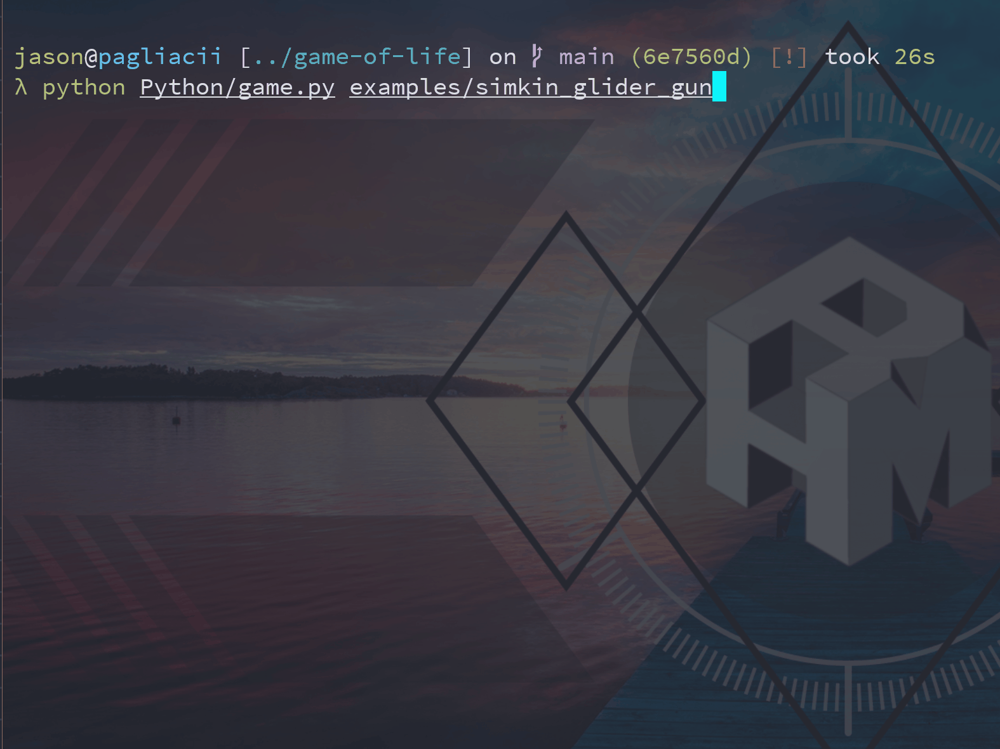

# :martial_arts_uniform: Kata - Conway's Game of Life

- [Conway's Game of Life](https://en.wikipedia.org/wiki/Conway%27s_Game_of_Life)
- [Kata](https://en.wikipedia.org/wiki/Kata_(programming))

## Implementations

## Screencasts

## Contributing

Feel free to submitting pull requests.
